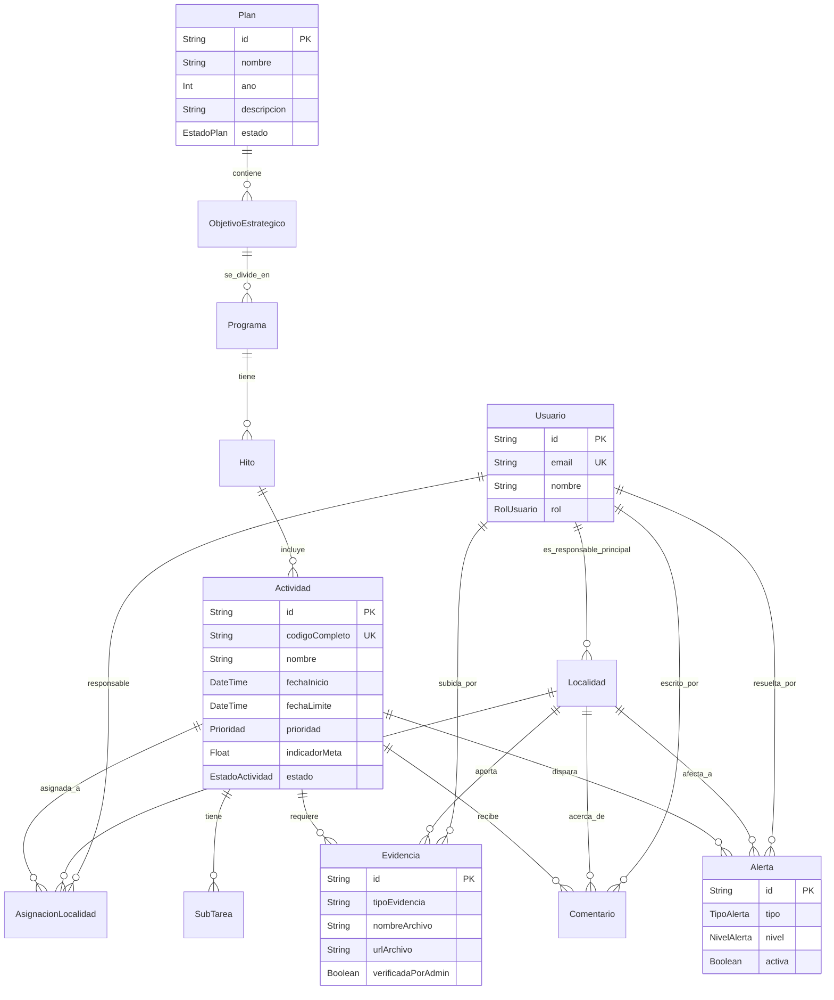

# Transformación Institucional - Monorepo

Este repositorio contiene el sistema de Seguimiento de Planes de Transformación Institucional.

## Entregable 1: Diagrama de Entidad Relación (ERD)

A continuación, el diagrama ERD generado en formato Mermaid que representa la estructura de la base de datos PostgreSQL mediante Prisma, incluyendo el modelo de roles local:

## Estructura del Proyecto

* `/backend`: Aplicación Express.js (REST API), Prisma ORM (PostgreSQL), MSAL Nodo (JWT validation), Tareas automáticas.
* `/frontend`: Aplicación React (Vite, Tailwind, Shadcn/UI, MSAL React) para el Dashboard y Kanban.
